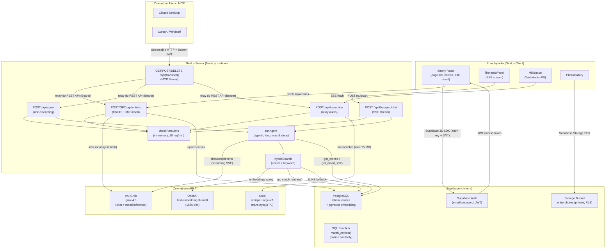

# Architektura systemu — Mood Journal (week-3)

## Przegląd systemu

Mood Journal to aplikacja webowa do prowadzenia dziennika nastroju. Użytkownik wpisuje (lub dyktuje) codzienną notatkę, a system automatycznie klasyfikuje nastrój (skala 1–5, pięć kategorii). Do każdego wpisu można dołączyć zdjęcia. Wbudowany asystent terapeutyczny (persona Dr. Aaron Beck, styl CBT) prowadzi rozmowę bazując na historii wpisów przeszukiwanej hybrydowo — wektorowo (pgvector + OpenAI embeddingi) i słownikowo (ILIKE). System udostępnia też serwer MCP, który pozwala zewnętrznym agentom AI (Claude Desktop, Cursor) czytać i pisać wpisy przez te same mechanizmy.

---

## Diagram architektury



---

## Komponenty

| Komponent | Technologia | Odpowiedzialność |
|---|---|---|
| **Frontend (strony)** | Next.js 14, React 18, Tailwind, shadcn/ui | Ekran dzisiejszego wpisu, lista historii, edycja, ekran wyniku |
| **TipTapEditor** | Tiptap (ProseMirror) | Edytor rich-text wpisów |
| **TherapistPanel** | React + SSE | Czat z terapeutą — konsumuje stream `text/event-stream` |
| **MicButton / useAudioRecorder** | Web Audio API (MediaRecorder) | Nagrywanie głosu i wysyłka do `/api/transcribe` |
| **PhotoGallery** | React | Podgląd i usuwanie zdjęć; przesyłanie przez Supabase Storage SDK |
| **API /api/entries** | Next.js Route Handler | CRUD wpisów; wywołuje Grok do inferencji nastroju gdy brak jawnej wartości |
| **API /api/transcribe** | Next.js Route Handler | Proxy audio → Groq Whisper v3 (PL, `whisper-large-v3`) |
| **API /api/therapist/chat** | Next.js Route Handler | Uruchamia `runAgent` i streamuje zdarzenia SSE do frontendu |
| **API /api/agent** | Next.js Route Handler | Niestreamująca wersja agenta; używana przez MCP |
| **runAgent** | TypeScript (`therapist/run-agent.ts`) | Pętla agenta (max 5 kroków): system prompt → Grok → narzędzia → odpowiedź |
| **hybridSearch** | TypeScript (`lib/search.ts`) | Łączy wyszukiwanie wektorowe (pgvector) z ILIKE; deduplikuje wyniki |
| **MCP Server** | `mcp-handler`, Next.js | Serwer MCP (Streamable HTTP) eksponujący 4 narzędzia przez `/api/[transport]` |
| **Rate limiter** | in-memory Map | 10 żądań / minutę / użytkownik; dane w pamięci procesu (nie persystuje) |
| **embed-entries.mts** | skrypt Node.js (tsx) | Jednorazowy skrypt — generuje embeddingi OpenAI dla wpisów bez wektora |
| **seed-200.mts** | skrypt Node.js (tsx) | Jednorazowy skrypt — zasila bazę 179 przykładowymi wpisami (persona: Marta) |

---

## Źródła danych

### Supabase PostgreSQL — tabela `entries`

| Kolumna | Typ | Opis |
|---|---|---|
| `id` | text (UUID) | Klucz główny |
| `user_id` | uuid | FK do Supabase Auth (RLS) |
| `date` | date | Data wpisu (uniq per user) |
| `mood_label` | text | Etykieta nastroju (np. "Happy") |
| `mood_category` | text | Kategoria: Positive / Calm / Neutral / Difficult / Intense |
| `text` | text | Treść wpisu (HTML z Tiptap) |
| `photos` | text[] | Ścieżki storage (`userId/date/uuid.ext`) |
| `embedding` | vector(1536) | Embedding OpenAI text-embedding-3-small |
| `created_at`, `updated_at` | timestamptz | Metadane |

Unikalne ograniczenie: `(user_id, date)` — jeden wpis na dzień.

Funkcja SQL `match_entries(query_embedding, match_count, p_user_id)` wykonuje wyszukiwanie cosine similarity przez pgvector (`<=>` operator).

### Supabase Storage — bucket `entry-photos`

Prywatny bucket z RLS. Pliki przechowywane pod ścieżką `{user_id}/{date}/{uuid}.{ext}`. Dostęp przez podpisane URL (TTL 1 godz.) generowane server-side.

### Supabase Auth

Uwierzytelnianie email/password. JWT access token przekazywany w nagłówku `Authorization: Bearer` do wszystkich API Routes. Server-side klient tworzy się przez `makeUserClient(accessToken)` — dzięki temu RLS Supabase działa automatycznie.

---

## Integracje i połączenia

| Integracja | Kierunek | Uwierzytelnianie | Cel |
|---|---|---|---|
| **xAI Grok** (`api.x.ai`) | out | `XAI_API_KEY` (Bearer, server-side) | Inferencja nastroju (1 wywołanie/wpis) + czat terapeutyczny (streaming SSE) |
| **OpenAI Embeddings** (`api.openai.com`) | out | `OPENAI_API_KEY` (Bearer, server-side) | Generowanie wektorów 1536-dim dla zapytań hybrydSearch + skrypt embed-entries |
| **Groq Whisper** (`api.groq.com`) | out | `GROQ_API_KEY` (Bearer, server-side) | Transkrypcja audio (język PL, model `whisper-large-v3`, max 25 MB) |
| **Supabase JS SDK** | out (klient + serwer) | Anon key + JWT (NEXT_PUBLIC_SUPABASE_ANON_KEY) | Operacje DB i Storage; RLS ogranicza dostęp do danych właściciela |
| **MCP Server** (`/api/[transport]`) | in | Bearer JWT (Supabase access token) | Zewnętrzni klienci MCP (Claude Desktop, Cursor) — relay do REST API |

Zmienne środowiskowe (tylko nazwy):

- `NEXT_PUBLIC_SUPABASE_URL` — adres projektu Supabase
- `NEXT_PUBLIC_SUPABASE_ANON_KEY` — klucz publiczny Supabase
- `XAI_API_KEY` — klucz xAI (Grok)
- `OPENAI_API_KEY` — klucz OpenAI (embeddingi)
- `GROQ_API_KEY` — klucz Groq (Whisper)
- `XAI_MODEL` — opcjonalne nadpisanie modelu Grok (domyślnie: `grok-4.3`)

---

## Przepływ danych

### 1. Tworzenie/aktualizacja wpisu (przeglądarka)

```
Użytkownik wypełnia formularz (MoodScale + TipTapEditor)
  → klik "Save"
  → useJournal.upsertToday()
  → POST /api/entries { text, moodLabel, photos }
    → requireVerifiedAuth() — weryfikacja JWT w Supabase Auth
    → checkRateLimit() — 10 req/min
    → jeśli mood pominięty: inferMoodScore(text) → Grok (JSON mode)
    → supabase.from("entries").upsert(...)  [RLS: user_id = auth.uid()]
  → redirect /result
```

### 2. Czat z terapeutą (TherapistPanel)

```
Użytkownik wpisuje wiadomość
  → POST /api/therapist/chat { messages, currentEntryId }
    → requireVerifiedAuth()
    → checkRateLimit()
    → loadEntryById() — opcjonalny kontekst bieżącego wpisu
    → runAgent() — pętla (max 5 iteracji):
        1. hybridSearch(lastUserMessage)
             → embedQuery() → OpenAI text-embedding-3-small
             → rpc match_entries() — cosine similarity (pgvector)
             + ILIKE fallback
        2. buildSystemPrompt(currentEntry, relevantEntries)
        3. detectCrisis(text) — regex PL+EN → SSE event "crisis" + helpline 116 123
        4. POST api.x.ai/v1/chat/completions (Grok, streaming)
           → SSE token → klient
           → jeśli tool_call: runTool()
               get_entries → supabase query (+ hybridSearch jeśli keyword)
               get_mood_stats → agregaty z supabase
           → kolejna iteracja
    → SSE event "done"
```

### 3. Transkrypcja głosu

```
MicButton nagrywa audio (MediaRecorder → WebM)
  → MicButton.stop() → POST /api/transcribe (multipart)
    → requireVerifiedAuth()
    → relay do api.groq.com/openai/v1/audio/transcriptions (whisper-large-v3, lang=pl)
  → wynik wstrzykiwany do TipTapEditor przez CustomEvent (JOURNAL_VOICE_INPUT_EVENT)
```

### 4. Zewnętrzny klient MCP

```
Claude Desktop / Cursor → Streamable HTTP POST /api/[transport]
  → Bearer token (Supabase JWT) w nagłówku
  → createMcpHandler (mcp-handler)
    → tool: create_entry   → relay POST /api/entries
    → tool: get_entry_by_date → relay GET /api/entries/{date}
    → tool: ask_agent      → relay POST /api/agent (niestreamujący runAgent)
    → tool: transcribe_audio → relay POST /api/transcribe
  → wynik MCP JSON
```

---

## Hosting i deployment

- **Środowisko lokalne (dev):** `pnpm dev` → Next.js dev server na porcie 3000.
- **Produkcja (planowana):** Vercel (wynika ze wzmianki w dokumentacji MCP — `your-app.vercel.app`). Aplikacja jest monolitem Next.js — API Routes uruchamiane jako Vercel Serverless Functions (Node.js runtime). `maxDuration: 60s` ustawione na endpointach AI.
- **Manager procesów:** brak pliku `docker-compose.yml`, `Dockerfile`, ani konfiguracji tmux/cron — deployment czysto serwerless.
- **Skrypty jednorazowe:** uruchamiane lokalnie przez `pnpm tsx scripts/...`.

---

## Otwarte pytania / TODO

- **Hosting produkcyjny** — dokumentacja MCP wspomina Vercel, ale brak pliku `vercel.json` ani CI/CD — [do weryfikacji czy deploy jest skonfigurowany].
- **Migracje bazy danych** — brak katalogu migracji (np. `supabase/migrations/`). Schemat tabeli `entries` i funkcja `match_entries` mogły być tworzone ręcznie w Supabase Dashboard — [do weryfikacji i utrwalenia jako migracja].
- **Rate limiting** — obecna implementacja in-memory nie skaluje się na wiele instancji serverless (każda instancja liczy osobno). Przy większym ruchu należy rozważyć Redis lub Supabase-based limiter.
- **Przechowywanie tokenów MCP** — tokeny JWT Supabase ważą ~1h. Nie ma mechanizmu automatycznego odświeżania po stronie klientów MCP — użytkownik musi ręcznie generować nowy token.
- **pgvector indeks** — brak informacji czy na kolumnie `embedding` założono indeks IVFFlat/HNSW — bez niego wyszukiwanie wektorowe na dużych zbiorach będzie wolne [do weryfikacji w Supabase Dashboard].
- **Dokumentacja REST API** — istnieje strona `/docs/api` i `/docs/mcp` wbudowana w aplikację, ale jej zawartość nie była czytana w całości — szczegóły REST [do weryfikacji].
